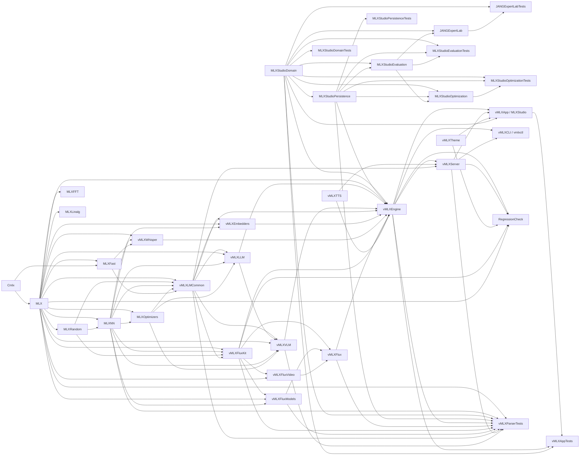
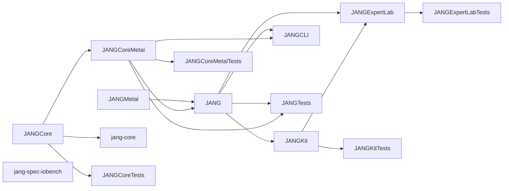
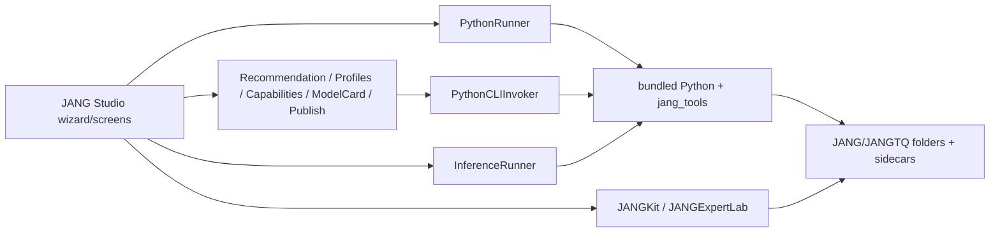
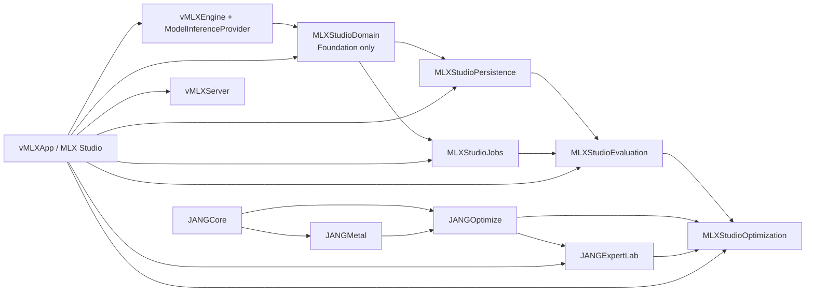
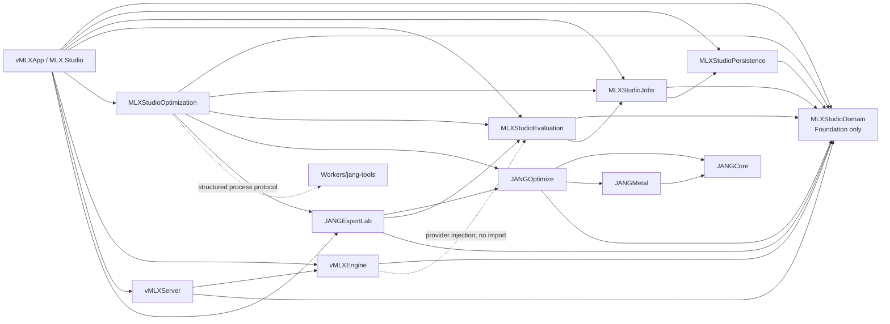

# Dependency graphs

The current graphs are derived from the pinned manifests, not inferred from folder names.

## Current MLX Studio targets

Arrows run from an internal dependency to its consumer. External package products (`Numerics`, `Transformers`, `Hummingbird`, `ArgumentParser`, and TLS/NIO products) are omitted so every node represents a current local SwiftPM target.

## Current JANG Swift targets

Arrows again run from dependency to consumer. `jang-spec-iobench` has no target dependency; external `ArgumentParser` edges are omitted.

At the pinned JANG source SHA, the problematic edge is `JANGKit → JANGExpertLab`: `ExpertPromptSuiteRunner` owns a `JANGKit.Model`, making Expert Lab depend on a second production inference runtime. In the canonical product package after PR 7, the adapted `JANGExpertLab` target instead depends on `MLXStudioDomain` and `MLXStudioEvaluation`; its suite runner accepts `ModelInferenceProvider` and has no `JANGKit` dependency.

## Current JANG Studio process graph

This process graph is migrated as one worker boundary; screens must not retain direct `Process` ownership.

## Proposed architecture flow

This is the decision-level flow requested by the consolidation brief: `MLXStudioDomain → Persistence/Jobs → Evaluation → Optimization`, `JANGCore/JANGMetal → JANGOptimize → JANGExpertLab`, `vMLXEngine → MLXStudioDomain`, and `vMLXApp →` every application-facing target. It is not an import graph.

## Proposed compile-time dependencies

In this graph, solid arrows mean “imports/depends on.” Dashed arrows are runtime composition boundaries, not target imports. `MLXStudioDomain` imports Foundation only and cannot import SQLite, SwiftUI, MLX, Metal, JANG, or Python/process code. Provider protocols use domain-owned request/result types. Concrete vMLX adapters live with `vMLXEngine`; worker adapters live with `MLXStudioOptimization`.

## Proposed target responsibilities

| Target | Owns | Must not own |
| --- | --- | --- |
| `MLXStudioDomain` | IDs, projects, sources, artifacts, manifests, plans, suites, requests/results, provider/strategy/worker protocols | SQLite, MLX tensors, SwiftUI, subprocesses |
| `MLXStudioPersistence` | repositories, migrations, transactions, repair/backfill | runtime loading or UI state |
| `MLXStudioJobs` | job state machine, durable events/log references, recovery | algorithm or download implementation |
| `MLXStudioEvaluation` | suite runner, scorers, manifests, comparison, blind assignment, scorecards | concrete model loading |
| `MLXStudioOptimization` | plan validation, estimates, build orchestration, worker adapter | screen state or alternate inference |
| `JANGCore` | portable formats, indices, manifests | UI and full production inference |
| `JANGMetal` | audited JANG-specific kernels not already owned by vMLX | duplicate device/runtime lifecycle |
| `JANGOptimize` | pruning strategy adapters, mask application, JANG/JANGTQ native operations as ported | evaluation policy or UI |
| `JANGExpertLab` | Atlas/evidence builders and expert-domain services | `JANGKit.Model`, SwiftUI, subprocesses |

## Import rules

1. No application target may bypass a repository with raw artifact paths for identity.
2. No evaluation or optimization target may instantiate `JANGKit.Model` or Python inference.
3. SwiftUI screens depend on service protocols, not worker/process actors.
4. `vMLXEngine` is the only target that adapts domain generation requests to loaded MLX models.
5. `vMLXServer` resolves artifact IDs through the repository and serves through vMLX; it does not become a second inference provider.
