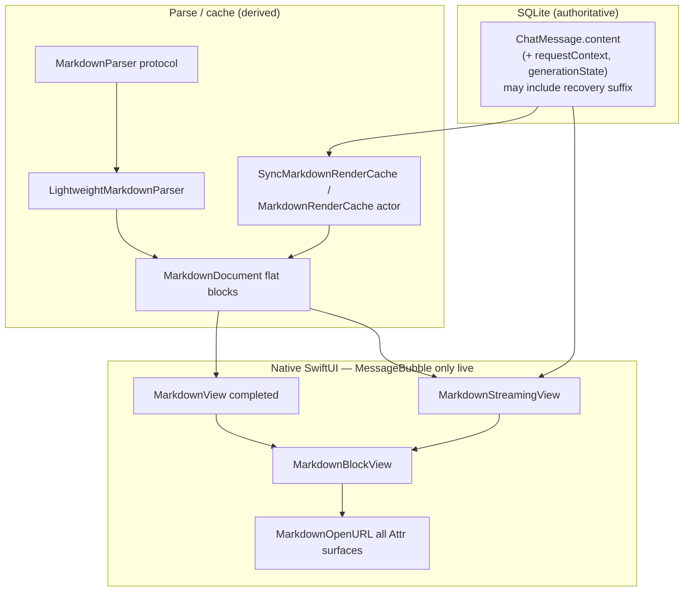
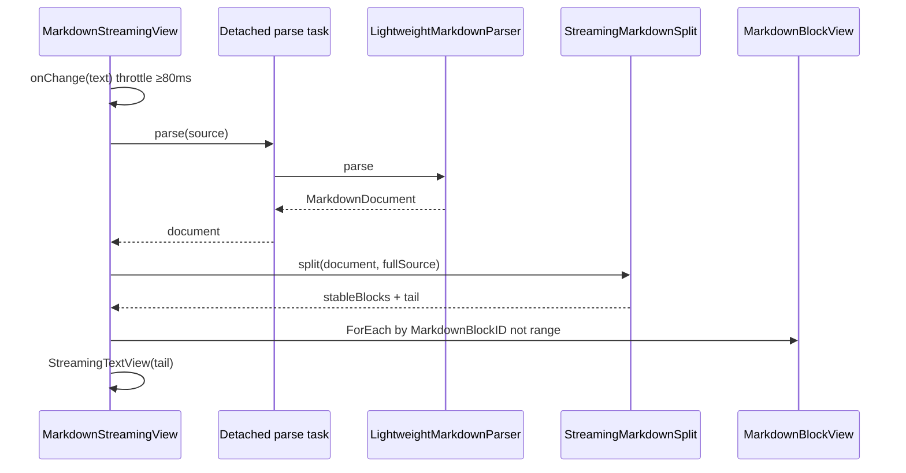
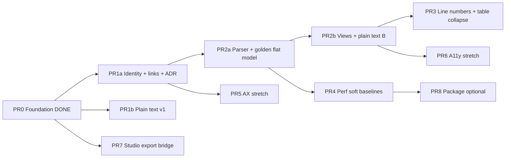

# MLX Studio — Next-Level Markdown (Release Completion)

| Field | Value |
| --- | --- |
| **Document title** | MLX Studio — Next-Level Markdown (Release Completion) |
| **Author** | MLX Studio engineering (design revision 2026-07-12) |
| **Date** | 2026-07-12 |
| **Status** | Draft (revision 4 — residual review E–F) |
| **Repo** | `/Users/hermes/Documents/Codex/2026-06-24/wha/work/mlx-studio-beta` |
| **Branch / baseline** | `codex/mlx-studio-private-beta-lfm` @ `3fea136` |
| **Deployment target** | macOS 14.0 (`Package.swift` platforms) |
| **Primary surface** | SQLite-backed production chat only: `ChatScreen` / `MessageBubble` (mounted from `RootView` `.chat`) |
| **Related ADRs** | [`docs/adr/001-markdown-profile.md`](docs/adr/001-markdown-profile.md), [`docs/adr/001-markdown-parser-spike.md`](docs/adr/001-markdown-parser-spike.md) — **refresh required** (see [ADR refresh](#adr-refresh-required)) |
| **Original plan** | Machine-local draft at `~/Desktop/MLX Studio - Next-Level Markdown Plan.md` (not in-repo; this doc is the implementation contract). Prefer copying under `docs/` if retained long-term. |

---

## Overview

Commit `3fea136` delivered the **foundation** for next-level chat Markdown: a parser-independent document model, progressive streaming, safe-link policy **types** (not yet wired on open), code/table affordances, composer preview, `requestContext` / `generationState` (SQLite `user_version` 4), JSON export v4 + import v1–4, golden corpus unit coverage, and ADRs.

**Production render path is already unified:** `RootView` mounts only `ChatScreen()` → `MessageBubble` for `.chat`. Unmounted legacy types `StudioChatScreen` / `ChatTurnBubble` in `MLXStudioScreens.swift` share Markdown view *types* but are **not** a second live chat runtime. Residual dual-path risk is **history/export** (`StudioChatHistoryStore` + `StudioChatSessionExporter` from Library), not dual renderers.

This design specifies remaining work for **release-quality** Markdown on that single production path: streaming identity stability, first-class GFM blocks (flat model), link safety on all AttributedString surfaces, Advanced line numbers, plain-text copy in phases, measured performance, and an honest automation vs manual gate for installed-app AX. Presentation only: no code execution, tools, autonomous actions, browser, or remote content fetching.

---

## Background & Motivation

### Product need

Local LLM chat is dense with Markdown. Users expect progressive formatting, reliable copy, and safe offline rendering.

### Current state (post-`3fea136`) — honest baseline

| Area | Shipped behavior | Remaining gap |
| --- | --- | --- |
| Document model | `MarkdownDocument` / `MarkdownBlock` / `MarkdownBlockID` under `Sources/vMLXApp/Common/Markdown/` | Only `prose`, `table`, `code`, `fallback`; no first-class heading/list/quote/task/break |
| Parser | `LightweightMarkdownParser` behind `MarkdownParser`; fence `` ``` `` / `~~~` **already**, GFM tables | Incomplete structural GFM; headings/lists/task lists/blockquotes/breaks fold into prose |
| Prose / cells | `MarkdownProseView` + `MarkdownTableCell` → `AttributedString(markdown:…, .inlineOnlyPreservingWhitespace)` | No link policy on open; block AX hierarchy lost |
| Streaming | `MarkdownStreamingView` + `StreamingMarkdownSplit`; 40 ms debounce + 80 ms min; open fence → provisional code | **Identity thrash**: `ForEach`/`MarkdownBlockID` use full `range` including growing `end` |
| Code | Copy, wrap, language labels, collapse @ 80 lines, provisional badge | No line numbers (Advanced); no syntax highlighting (deferred) |
| Tables | Native `Grid` + scroll; Copy Markdown / TSV | Pathological collapse; stronger row/column AX |
| Links | `MarkdownLinkPolicy` unit-tested | **Dead on open path** — no production `openUserActivated` / `OpenURLAction` |
| Composer | `InputBar`: ⌘↩ send, Return newline, Preview → `MarkdownView` (non-mutating) | Optional Advanced placement polish |
| Data model | `content` + `requestContext`; `generationState`; SQLite v4 | Interrupted recovery **appends** ` [interrupted]` to `content` (documented below) |
| Export | `ChatExporter` JSON v4 + dynamic fences | `StudioChatSessionExporter` schemaVersion **1**, no dynamic fences; Library still uses it |
| Chat UI surfaces | **Only** `MessageBubble` mounted for chat | Unmounted Studio types remain in tree; dual **history/export** only |
| QA | Golden JSON (7 cases) + Markdown* unit tests; smoke runs unit filters | AX click/pasteboard not automated; perf numbers unrecorded |

### Pain points this design closes

1. Streaming block identity remounts provisional code/list UI and rotates AX copy IDs.
2. Incomplete GFM as first-class UI (lists/headings still flat prose).
3. Link safety incomplete at activation (all AttributedString surfaces).
4. Release gates: perf measured; AX smoke either executable or demoted to manual checklist.
5. Plain-text copy quality (phased: current blocks first, structural after PR2a).
6. Studio **exporter** drift vs production `ChatExporter` (not dual live chat).

---

## Goals & Non-Goals

### Goals

1. GFM core profile rendered natively and consistently for completed and streaming assistant messages on **`MessageBubble`**.
2. Progressive stream rendering with completed blocks + mutable tail; **provisional-stable** block IDs across growth and close.
3. Useful, copyable code/tables with message-stable accessibility identifiers after close; provisional IDs stable while open.
4. Safe presentation: HTML inert, scheme allowlist on open (all surfaces), no auto remote images, no execution.
5. One **live** renderer path for generated, imported, reopened, stopped, and failed assistant content.
6. Durable source of truth: raw Markdown in SQLite (`messages.content`), with documented recovery suffixes when present.
7. Measurable gates: golden corpus, unit security, perf soft-baselines; AX automation if environment allows, else explicit manual checklist.

### Non-Goals

- Code execution, shell/tool invocation, or agent actions from Markdown.
- Remote content fetch to render messages.
- WebView / HTML rendering of chat Markdown.
- Treating arbitrary `.md` import as a lossless chat archive.
- Math, Mermaid, footnotes/citations as P0 (deferred P1/P2).
- Replacing lightweight parser with MarkdownUI/cmark unless packaging gate passes.
- Spec-perfect cmark nested-list parity (see model-output tolerance).
- HTML blocks, reference-style link definitions, setext headings, indented code blocks (explicit non-support for P0).

---

## Key Decisions

| # | Decision | Rationale |
| --- | --- | --- |
| K1 | **Parser-independent document model** remains the API boundary | UI/safety swappable if a GFM AST package lands later. |
| K2 | **Keep `LightweightMarkdownParser` in production** until packaging gate green | Zero deps, offline-safe; expand grammar in-tree for P0. |
| K3 | **Native SwiftUI only** — never WebKit for chat Markdown | AX, theming, offline, XSS control. |
| K4 | **Raw Markdown is durable SOT**; cache is revision-keyed disposable state | Exception: intentional recovery **suffix markers** on `content` (see interrupted recovery). |
| K5 | **Flat `blocks: [MarkdownBlock]` for P0** — no recursive `children` trees | Matches existing ForEach/split/golden arrays; blockquotes use `quoteDepth` + contained text, not nested block arrays. |
| K6 | **Inline content stays `text: String` + AttributedString** for P0 — no `MarkdownInlineRun` AST | Avoids unimplementable mid-layer; structural blocks own layout; emphasis/links stay system Markdown inline. |
| K7 | **All link opens go through shared `MarkdownOpenURL`** on **every** AttributedString markdown surface | Prose, table cells, future heading/list text. Strip disallowed link attributes by default; `OpenURLAction` as belt. |
| K8 | **Beginner defaults; line numbers via per-block overflow + UserDefaults** `chat.markdown.showLineNumbers` (default false) | Single Advanced preference; overflow can toggle for one session without separate mode flag. |
| K9 | **JSON v4 is production archive; Studio JSON stays schemaVersion 1** until adapter lands | Do not pretend Studio exports are v4 without mapping. |
| K10 | **No schema bump for Markdown UI** (stay `user_version` 4); Advanced prefs in UserDefaults | |
| K11 | **Task-list checkboxes are display-only** — never mutate stored message Markdown | Avoid hidden state edits on model output. |
| K12 | **List indent: model-output tolerant** — indent steps of 2 spaces (or one tab) count as one nesting level; depth cap **6** | LLMs emit 2-space lists far more than strict GFM 4-space. Not full cmark edge parity. |
| K13 | **Streaming identity is start-stable while provisional** | A block is provisional when (1) open code fence (`!isClosed`), or (2) while streaming, it is a **terminal-growing** block (`range.end == source.utf16.count`). Key = `(kind, range.start, messageID)` while provisional; freeze `range.end` into ID only when finalized. |
| K14 | **`mailto:` remains allowlisted** with http/https | Useful in research chat; still user-activated only. |
| K15 | **User-activated copy of untrusted model text is accepted risk** | Pasteboard may contain secrets the model emitted; no sanitizer beyond user intent. |
| K16 | **Live chat surface = `MessageBubble` only**; unmounted Studio chat code is legacy | Markdown feature work targets production path; Library export is separate hygiene. |
| K17 | **macOS 14.0** is the minimum for openURL / AttributedString verification matrix | Matches `Package.swift`. |

---

## Proposed Design

### Architecture (baseline + target)



**Existing files (baseline):**

| Path | Role |
| --- | --- |
| `Sources/vMLXApp/Common/Markdown/MarkdownDocument.swift` | Ranges, block kinds, document, block IDs |
| `Sources/vMLXApp/Common/Markdown/MarkdownParser.swift` | Protocol + `LightweightMarkdownParser` |
| `Sources/vMLXApp/Common/Markdown/MarkdownRenderCache.swift` | Actor + sync cache (capacity **64**) |
| `Sources/vMLXApp/Common/Markdown/MarkdownStreamingView.swift` | Streaming split + `MarkdownBlockView` + prose |
| `Sources/vMLXApp/Common/Markdown/MarkdownLinkPolicy.swift` | Scheme allowlist + open helpers |
| `Sources/vMLXApp/Common/Markdown/MarkdownLanguage.swift` | Language labels + table clipboard |
| `Sources/vMLXApp/Common/MarkdownView.swift` | Completed shell, table UI, code UI, **table cells with AttributedString** |
| `Sources/vMLXApp/Chat/MessageBubble.swift` | **Sole live** assistant Markdown path |
| `Sources/vMLXApp/Chat/InputBar.swift` | Composer send/preview |
| `Sources/vMLXApp/Chat/ChatExporter.swift` / `ChatImporter.swift` | JSON v4 + MD transcript |
| `Sources/vMLXApp/Storage/Models.swift` / `Database.swift` | Message model + migration v4 |
| `Sources/vMLXApp/MLXStudio/MLXStudioScreens.swift` | Unmounted `StudioChatScreen` / `ChatTurnBubble` (legacy) |
| `Sources/vMLXApp/MLXStudio/StudioChatSessionExporter.swift` | Library export schemaVersion 1 |
| `Sources/vMLXApp/vMLXApp.swift` | `RootView` → `ChatScreen()` only for `.chat` |

---

### Streaming block identity (critical — PR1 prerequisite / PR0 bugfix)

#### Problem (current code)

- Open fences set `range.end = text.endIndex` (`MarkdownParser.swift`).
- `MarkdownView` / `MarkdownStreamingView` use `ForEach(..., id: \.element.range)`.
- `MarkdownBlockID` and `copyCodeAccessibilityIdentifier` embed **both** `start` and `end`.
- Each reparse while a provisional fence grows **changes identity** → remounts `CodeBlockView` (loses wrap/expanded/copied `@State`) and rotates AX IDs. Closing the fence jumps `end` again.

#### Normative identity contract

```text
Final (closed / completed) block ID:
  messageUUID + kind + rangeRange.start + sourceRange.end
  → markdown.<kind>.<uuid>.<start>-<end>
  → markdown.copy-code.<uuid>.<start>-<end>

Provisional (open / incomplete) block ID:
  messageUUID + kind + sourceRange.start + marker "open"
  → markdown.<kind>.<uuid>.<start>-open
  → markdown.copy-code.<uuid>.<start>-open
```

Rules:

1. **Provisional predicate (normative — applies to all block kinds, not only code):**

   ```text
   isProvisional(block, source, isStreaming) =
     (block is code && !isClosed)
     OR (isStreaming && block.range.end == source.utf16.count)
   ```

   - Case (1): open fence — body grows; `range.end` tracks source end even mid-document in current parser.
   - Case (2): **terminal-growing** block — while streaming, the last block whose range still covers the live source end (prose, blockquote run, list/task item, heading, table still being extended, etc.) is provisional. Identity ignores `range.end`.
2. When **not** provisional, identity includes full `range.start`–`range.end` and is stable for that message revision.
3. On finalization (`isStreaming == false`) or when a block is no longer terminal (a new sibling block starts after it), identity freezes to the full range once. A single remount at that transition is acceptable; identity must **not** change on every token append while provisional.
4. `ForEach` must key off `MarkdownBlockID` (or an explicit `stableKey`), **not** raw `range`.
5. Closed blocks that finish mid-stream keep their final range forever for that message revision.
6. Call sites that build IDs (`MarkdownBlockView`, streaming/completed shells) must pass **normalized source + `isStreaming`** into the ID factory so structural blocks after PR2a inherit the same rule without a second special-case.

#### Implementation sketch (normative)

```swift
// MarkdownDocument.swift — normative shape
extension MarkdownBlockID {
    /// End-invariant while open/terminal-growing.
    var isProvisional: Bool { /* true when end marker is "open" */ }

    /// - Parameters:
    ///   - source: normalized document source (UTF-16 length basis for ranges).
    ///   - isStreaming: true for in-flight assistant bubbles / MarkdownStreamingView.
    static func id(
        messageID: UUID?,
        block: MarkdownBlock,
        source: String,
        isStreaming: Bool
    ) -> MarkdownBlockID {
        let provisional: Bool = {
            if case .code(_, _, _, let isClosed) = block, !isClosed {
                return true
            }
            if isStreaming, block.range.end == source.utf16.count {
                return true
            }
            return false
        }()
        return MarkdownBlockID(
            messageID: messageID,
            range: block.range,
            kind: block.kind,
            provisional: provisional
        )
    }
}
```

Accessibility string form unchanged: provisional → `markdown.<kind>.<uuid>.<start>-open` (and `markdown.copy-code.<uuid>.<start>-open` for code).

#### Required tests

- Append lines inside open fence: `copyCodeAccessibilityIdentifier` **unchanged**.
- `@State` wrap/expanded on provisional code preserved across reparse (view identity stable).
- After close, ID freezes to full range; remains stable on reload of same source.
- **Terminal structural growth (PR1a helper + PR2a golden):** while `isStreaming == true`, parse a blockquote of two `>` lines, then three `>` lines with the same start offset; `MarkdownBlockID` string for that block is **unchanged** (still `…-open`). Same pattern for a trailing prose paragraph that gains more text.
- When streaming ends, the same block’s ID becomes the final `start-end` form and stays stable on reparse of the frozen source.

**Ship this before expanding structural GFM** (PR1a). PR1a must implement the **general** provisional predicate (not code-only), so PR2a blockquote/list/prose terminal growth cannot reintroduce thrash.

---

### Target document model (P0 — flat, concrete)

**Normative** block model for PR2a. No recursive children. No `MarkdownInlineRun` type.

```swift
// Normative — Sources/vMLXApp/Common/Markdown/MarkdownDocument.swift

enum MarkdownBlockKind: String, Hashable, Sendable, Codable {
    case prose
    case heading
    case listItem        // one visual item; nesting via indentLevel
    case taskItem        // one visual task row
    case blockquote      // contiguous quote run (flat; see `.blockquote` case)
    case thematicBreak
    case table
    case code
    case fallback
}

enum MarkdownBlock: Hashable, Sendable {
    case prose(text: String, range: MarkdownSourceRange)
    case heading(level: Int, text: String, range: MarkdownSourceRange) // level 1...6
    /// Single list item. Nested lists = successive items with higher indentLevel.
    case listItem(
        ordered: Bool,
        index: Int?,           // 1-based when ordered; nil when unordered
        indentLevel: Int,      // 0...5 (depth cap 6 levels)
        text: String,          // item body Markdown (inline only)
        range: MarkdownSourceRange
    )
    case taskItem(
        checked: Bool,
        indentLevel: Int,
        text: String,
        range: MarkdownSourceRange
    )
    /// Contiguous blockquote region as one block (lines joined with \n).
    /// quoteDepth is min leading `>` count for the run; deeper nesting is
    /// flattened to text prefixes if mixed — good enough for chat P0.
    case blockquote(text: String, quoteDepth: Int, range: MarkdownSourceRange)
    case thematicBreak(range: MarkdownSourceRange)
    case table(
        headers: [String],
        alignments: [MarkdownTableAlignment],
        rows: [[String]],
        range: MarkdownSourceRange
    )
    case code(
        language: String,
        body: String,
        range: MarkdownSourceRange,
        isClosed: Bool
    )
    case fallback(text: String, range: MarkdownSourceRange)
}
```

**Why flat list items (not tree lists):** golden `blockKinds` stays a linear array; streaming split stays linear; plain-text walk is a simple for-loop; Hashable stays trivial.

**Inline policy:** `text` fields contain inline Markdown; views use shared helper:

```swift
enum MarkdownAttributed {
    /// Builds AttributedString with disallowed link attributes stripped,
    /// then apply MarkdownOpenURL.action via environment on the Text.
    static func inline(_ source: String) -> AttributedString
}
```

#### Call sites that must update exhaustive switches (migration checklist)

| File | Symbols |
| --- | --- |
| `MarkdownStreamingView.swift` | `MarkdownBlockView.body` |
| `MarkdownView.swift` | `MarkdownView.parse` Segment mapping; any switch on blocks |
| `MarkdownDocument.swift` | `kind`, `range`, `blockID` |
| `MarkdownPlainText.swift` (new) | walk all cases |
| `tests/vMLXAppTests/MarkdownDocumentTests.swift` | block switches |
| `tests/vMLXAppTests/MarkdownStreamingTests.swift` | open fence cases |
| `tests/vMLXAppTests/MarkdownRenderModelTests.swift` | segment counts |
| Golden loader in tests | `blockKinds` expectations |

Legacy `MarkdownView.Segment` remains prose/table/code only: structural blocks map to `.prose(renderedPlainOrSource)` for compatibility API, **or** Segment gains cases in the same PR as views (prefer expand Segment in PR2b).

---

### Parser strategy (remaining work)

#### Priority order when scanning lines

1. Fenced code (existing; highest)
2. GFM tables (existing)
3. Thematic break (line-only `---`, `***`, `___` with optional spaces)
4. ATX heading (`#{1,6} `)
5. Blockquote run (`>` …)
6. Task item / list item
7. Else accumulate prose

#### Nested lists — decided (K12)

| Rule | Value |
| --- | --- |
| Indent unit | 2 spaces **or** 1 tab → +1 `indentLevel` |
| Depth cap | 6 (`indentLevel` 0…5); deeper items clamp to 5 |
| Markers | unordered `-` `*` `+`; ordered `1.` / `1)` |
| Tight lists | Supported (no blank line required between items) |
| Loose lists | Blank line(s) between consecutive list/task items keep **one sequence** (do **not** reset ordered counters) |
| Task items | `- [ ]` / `- [x]` / `* [ ]` (case-insensitive x) |
| Non-support | Definition lists; HTML list tags; lazy continuation without indent (treat as prose) |

#### Ordered-list numbering and list boundaries (normative)

Complements K12 / `listItem.index`:

1. **Per-`indentLevel` counters.** Each nesting level maintains its own ordered counter. Nested children never advance the parent counter.
2. **Reset only on non-list interruption (not loose-list blanks).**
   - **Do not reset** when a blank line appears **between consecutive list/task items** (canonical loose list). Example: `1. first` / blank / `2. second` → indices continue as one sequence (1 then 2 if start was 1).
   - **Do reset** all ordered counters when a **non-list block** appears (prose, heading, fence, table, thematic break, blockquote) or the document ends. The next ordered item after that interruption starts a new sequence (source start honored).
   - Do **not** treat blank lines alone as a hard separator (no “N≥2 blanks reset” rule) — keeps alignment with K12 “same list sequence” and GFM-style loose lists.
3. **Source start index honored.** The first ordered item at a given level after a reset uses the integer written in the source (`3.` → `index = 3`). Subsequent items at that same level **increment by 1** from the previous item’s assigned `index`, regardless of the number written in the source (model output often renumbers inconsistently). Display uses assigned `index`.
4. **Parent continuation after nested children.** After a nested block at `indentLevel+1`, an ordered item returning to the parent `indentLevel` **continues** the parent counter (does not restart at 1), matching common GFM reader expectation.
5. **Unordered / task items** do not use `index` (`index == nil`). They still participate in the same indentLevel nesting and interruption rules.
6. **Task vs ordered at same indent:** a task marker starts/continues an unordered-style task sequence; it does not advance an ordered counter at that level.

#### Model-output tolerance fixtures (add to golden **before** PR2a merge)

Required new cases in `tests/e2e/fixtures/markdown-golden.json`:

| Case id | Intent |
| --- | --- |
| `list-2space-nested` | 2-space nested unordered list → indentLevel 0 then 1 |
| `list-mixed-tight` | Tight `-` list without blank lines |
| `task-list-basic` | Unchecked/checked task items |
| `heading-atx-levels` | `#` … `###` as heading blocks |
| `blockquote-simple` | Multi-line `>` as one blockquote block |
| `thematic-break-hr` | `---` between paragraphs |
| `list-over-indent-clamp` | 8+ levels clamp to depth 6 |
| `sloppy-list-tab-indent` | Tab-indented child item |
| `list-ordered-start-at-3` | First item `3.` → index 3; next item index 4 |
| `list-ordered-nested-continue` | Parent 1, nested child, parent continues as 2 (not restart) |
| `list-ordered-restart-after-prose` | Ordered list, prose interruption, new ordered list restarts (source start honored) |
| `list-ordered-loose-continue` | `1. a` / blank line / `2. b` → same sequence, indices 1 then 2 (blank does **not** reset) |

#### Explicit P0 non-support

- HTML blocks / raw HTML interpretation (inert prose only)
- Reference-style links `[text][id]` / definitions
- Setext headings
- Indented code blocks (4-space)
- Footnotes, math, Mermaid
- Nested blockquotes as separate recursive trees (depth reflected in `quoteDepth` + text only)

#### `incompleteTail`

Parser may continue to leave `incompleteTail == nil` for P0; streaming split uses last-block-end vs source end. Open fence remains provisional code (not tail). Optional later: trailing incomplete list marker as tail.

---

### Link open — all AttributedString surfaces (security)

**Shared module** (new or extend `MarkdownLinkPolicy.swift`):

```swift
enum MarkdownOpenURL {
    static var action: OpenURLAction {
        OpenURLAction { url in
            guard MarkdownLinkPolicy.isAllowed(url) else { return .discarded }
            return MarkdownLinkPolicy.openUserActivated(url) ? .handled : .discarded
        }
    }

    /// Strip link runs whose URL fails allowlist so click targets cannot open.
    static func sanitizeLinks(_ attributed: AttributedString) -> AttributedString
}
```

**Apply to every surface that builds markdown AttributedString today or in PR2b:**

| Surface | File |
| --- | --- |
| `MarkdownProseView` | `MarkdownStreamingView.swift` |
| `MarkdownTableCell` | `MarkdownView.swift` |
| Future `MarkdownHeadingView` / list item text | PR2b |
| Composer preview reuses same views | automatic |

**Default:** sanitize attributes **and** set `.environment(\.openURL, MarkdownOpenURL.action)`.

**Verification:** unit tests on `isAllowed` decision matrix (already partially present); add tests that `sanitizeLinks` removes `javascript:` / `file:`; manual/AppKit check on macOS 14 that discarded action does not open. If env openURL is bypassed on any build, sanitize alone is the hard guarantee.

**`mailto:`:** keep allowed (K14).

---

### Rendering

| Block | View | Notes |
| --- | --- | --- |
| Heading | `MarkdownHeadingView` | Font by level; accessibility header trait + level |
| listItem | `MarkdownListItemView` | Indent padding; bullet/number |
| taskItem | `MarkdownTaskItemView` | **Read-only** checkbox chrome; not Toggle bound to message |
| blockquote | `MarkdownBlockquoteView` | Leading bar; body via `MarkdownAttributed.inline` |
| thematicBreak | `Divider` | |
| prose | `MarkdownProseView` | + `MarkdownOpenURL` |
| code | `CodeBlockView` | Provisional badge; Advanced line numbers |
| table | `MarkdownTableBlockView` | Collapse when rows > 100 |

Streaming sequence unchanged except identity keys:



### Streaming rules (contract)

1. Reparse off main on cadence (40 ms debounce + 80 ms min interval).
2. Completed blocks render immediately; mutable tail uses `StreamingTextView`.
3. Open fence → provisional code (`isClosed: false`), not plain tail.
4. **Provisional IDs are start-stable** for open code **and** any streaming terminal-growing block (see identity section); final IDs freeze when streaming ends or the block is no longer terminal.
5. Stopped / failed / interrupted persistence — see next subsection (suffix is intentional).

### Interrupted / stopped content mutation (documented SOT exception)

**Actual code today:**

- `Database.markAllStreamingAsInterrupted`: sets `is_streaming = 0`, `generation_state = 'interrupted'`, and **`content = content || ' [interrupted]'`**.
- `ChatViewModel.cancelActiveGeneration(marking:)` appends `"\n[interrupted]"` or `"[stopped]"` when not already present, and sets `generationState`.

**Design stance (keep for P0):**

| Marker | When | `generationState` |
| --- | --- | --- |
| ` [interrupted]` or `\n[interrupted]` | Force-quit mid-stream, session switch cancel, etc. | `.interrupted` |
| `\n[stopped]` / `[stopped]` | User stop | `.stopped` |

These markers are **durable UX suffixes** on the Markdown SOT, not parser features. They appear as trailing prose after parse. Do **not** claim “unmodified partial Markdown” when recovery ran.

**Optional later (out of P0):** stop mutating `content`; show chrome from `generationState` only. Would need migration to strip historical suffixes — not required for release.

**Tests:** export/import and golden-adjacent unit tests must accept suffix presence after recovery; renderer must not crash on trailing marker text.

### Completed-message parse / main-thread strategy

| Path | Today | Target |
| --- | --- | --- |
| Streaming | `Task.detached` parse | Keep |
| Completed `MarkdownView.body` | `parseSync` on main (cache hit O(1); **cold parse on main**) | Mitigate |

**Operational definition of “responsive”:**

- Prefer **&lt; 8 ms** of synchronous parse+block-construction on the main actor per message body evaluation when cache misses are avoided.
- Cold parse of 100 KB may exceed that once; must not hitch **repeatedly** (scroll, hover, theme toggle).

**Mitigations (PR4 + optional PR2b):**

1. **Parse-on-ingest / on stream finalize:** when a message completes or is imported, warm `SyncMarkdownRenderCache` / actor cache off main before first paint of the bubble when possible.
2. **Cache capacity:** raise default from 64 → **128** for long sessions; document eviction = re-parse cost.
3. **Collapse before layout:** code &gt;80 lines and tables &gt;100 rows already/planned collapse reduce view count.
4. **Measure end-to-end:** first paint / layout of fixture messages, not only `parser.parse` microseconds.
5. If cold open of imported 100 KB still hits: show plain `Text` placeholder one frame then swap (last resort).

### Code block Advanced affordances

| Feature | Mode | Notes |
| --- | --- | --- |
| Copy | Default | Full body to pasteboard |
| Wrap / scroll | Default | Existing |
| Collapse long | Default | 80 lines |
| Line numbers | Advanced | Source-line gutter 1…N; driven by `UserDefaults` key `chat.markdown.showLineNumbers` **and** per-block overflow “Show line numbers” that can override locally via `@State` without clearing global |
| Syntax highlight | P1 deferred | |

### Tables — remaining policy

- Long cells wrap; wide tables scroll horizontally.
- **Collapse threshold:** `rows.count > 100` → show first 100 + “Show full table” (fixed for P0; pixel-width heuristic deferred).
- Clipboard: `MarkdownTableClipboard` unchanged.

### Plain-text copy — phased

**Phase A (with PR1b, current blocks only):**

```swift
enum MarkdownPlainText {
    static func from(document: MarkdownDocument) -> String
}
```

| Block | Output |
| --- | --- |
| prose | Improved marker strip (bold/italic/strike/code spans); links → `label (url)` if allowed else label |
| code | body only |
| table | TSV via existing helper |
| fallback | text as-is |

**Phase B (end of PR2a/PR2b):** headings, listItem, taskItem, blockquote, thematicBreak rules as linear walk. No second grammar.

`MessageBubble.copyResponse(plain:)` calls Phase A/B helper; Markdown path remains raw `content` (including recovery suffixes if present).

### Composer

- Already: source-first, ⌘↩ send, Return newline, non-mutating preview via `MarkdownView`.
- Preview uses same openURL sanitization automatically.
- Optional: hide Preview behind Advanced later — not a release blocker.

### Chat surfaces (corrected)

| Surface | Status |
| --- | --- |
| `ChatScreen` / `MessageBubble` | **Live production path** |
| `StudioChatScreen` / `ChatTurnBubble` | **Unmounted** legacy; keep compiling or delete in a cleanup PR; not dual Markdown runtime |
| Library Studio session export | Live; uses `StudioChatSessionExporter` |

Do not invest in ChatTurnBubble feature parity for Markdown release; keep shared types so accidental remount would not regress.

---

## API / Interface Changes

### Parser protocol (unchanged)

```swift
protocol MarkdownParser: Sendable {
    var name: String { get }
    func parse(_ source: String) -> MarkdownDocument
}
```

### New / extended types

| Symbol | Change |
| --- | --- |
| `MarkdownBlock` / `MarkdownBlockKind` | Flat structural cases (normative above) |
| `MarkdownBlockID` | Provisional flag / open end marker |
| `MarkdownOpenURL` / `MarkdownAttributed` | Shared link sanitize + open |
| `MarkdownPlainText` | Phased plain-text |
| `CodeBlockView` | `showLineNumbers` from defaults + local override |
| `MarkdownBlockView` | New cases |
| `ForEach` identity | `MarkdownBlockID`, not `range` |

### Compatibility

- Golden corpus expands `blockKinds` per case.
- `MarkdownView.parse` Segment API: map unknown structural → prose for one PR if needed, then expand.

---

## Data Model Changes

### Already shipped

**SQLite `user_version` 4** — `request_context`, `generation_state`.

**`ChatMessage`:** `content` / `displayContent` alias, `requestContext`, `modelPayloadContent`, `generationState`.

**JSON v4** (`ChatExporter`): `contentFormat: "gfm"`, display/context split, generation state. Import v1–4.

**Recovery suffix** on `content` as documented above.

### Studio exporter consolidation (PR7 — concrete option A)

**Choice: A — shared helpers + adapter; Studio JSON stays schemaVersion 1 for wire format unless Library switches callers to ChatExporter for SQLite sessions.**

```swift
// Normative adapter outline — compiles against ChatExporter APIs
enum StudioChatExportBridge {
    /// Map legacy Studio session → production types for MD transcript helpers only.
    static func chatSession(from studio: StudioChatSession) -> ChatSession
    static func messages(from studio: StudioChatSession) -> [ChatMessage]

    /// Full non-lossless transcript (preferred Library “export as Markdown” path).
    static func markdownTranscript(for studio: StudioChatSession) -> String {
        let session = chatSession(from: studio)
        let messages = messages(from: studio)
        return ChatExporter.exportToMarkdown(session, messages: messages)
    }

    /// Studio Purpose/Handoff summary template may remain Studio-specific, but any
    /// fenced body (reasoning, tool dumps, long excerpts) must use ChatExporter.fenced
    /// so embedded backticks cannot break the export.
    static func summaryMarkdown(for studio: StudioChatSession, exportedAt: Date = Date()) -> String {
        // Keep existing summary sections (Purpose / Latest Response / Handoff).
        // When embedding multi-line model text, wrap with ChatExporter.fenced("text", body).
        …
    }
}
```

**Field mapping:**

| Studio | ChatMessage / ChatSession |
| --- | --- |
| `session.id` | `ChatSession.id` |
| `session.title` | `title` |
| `session.modelName` | `modelName` |
| `session.createdAt` / `updatedAt` | same |
| `session.isPinned` | `isPinned` |
| `turn.role` | `ChatMessage.Role` |
| `turn.content` (cleaned) | `content` |
| `turn.streamState` | map to `generationState` when possible (`.failed` → `.failed`, `.streaming` should not appear in export) |
| requestContext | empty (Studio turns never split context) |

**Markdown:** Studio MD must use `ChatExporter.fenced` for any fenced sections and the non-lossless transcript header pattern where applicable; stop dumping raw turns without fence safety for embedded backticks.

**JSON:** Keep `schemaVersion: 1` Studio envelope for backward compatibility of Library exports **or** add parallel “Export as production JSON v4” via bridge — prefer shared `fenced` + MD first; JSON v4 upgrade is optional follow-up once Library reads SQLite sessions.

**Acceptance:** existing `StudioChatSessionExporterTests` still pass; new test that embedded triple-backticks in a turn do not break Studio MD export after consolidation.

**Not blocked** on full SQLite unification of Studio history.

---

## Alternatives Considered

### A. WebKit / HTML

**Rejected** — XSS, remote resources, non-native AX.

### B. MarkdownUI as production renderer

**Deferred** — packaging gate (ADR 001b). Optional post-release PR8.

### C. cmark-gfm bindings

**Deferred** — same gate.

### D. Stay lightweight and expand in-tree (chosen for P0)

**Chosen.** Grammar risk is real (see Risks); mitigated by flat model, model-output fixtures first, explicit non-support list.

### E. Dual stream/final renderers

**Rejected** — progressive document model already ships.

### F. Recursive block tree for blockquotes/lists

**Rejected for P0** — flat items + indent/quoteDepth; trees deferred if package AST arrives.

---

## Security & Privacy Considerations

| Threat | Severity | Mitigation |
| --- | --- | --- |
| HTML / script in model output | High | Never interpret HTML; inert prose (golden) |
| `javascript:`, `file:`, custom schemes, `data:` | High | Allowlist; **sanitize link attrs + OpenURLAction** on all Attr surfaces |
| Auto remote image load | Medium | No remote image fetch |
| Code “Run” | High (product) | No run control |
| `mailto:` open | Low (product accepted) | Keep allowlist; user-activated only (K14) |
| Clipboard secrets from model | Accepted | User-initiated copy of untrusted text (K15) |
| requestContext in export | Medium | MD notes size; JSON archive includes context by design |
| Pathological Markdown | Medium | Collapse; off-main stream parse; cache; soft size warn |
| Package supply chain | Medium | Packaging gate for any new dep |

**Threat model:** Markdown is untrusted display of local model output. External effects require user activation.

---

## Observability

| Signal | Where | Purpose |
| --- | --- | --- |
| Parse duration cold/cached | DEBUG `os_log` subsystem `mlx.markdown` | Budgets |
| First-paint / layout timing | DEBUG / XCTest metrics | Hitch definition |
| Reparse count during stream | DEBUG | Thrash detection |
| Smoke exit codes | `tests/e2e/mlx-studio-markdown-smoke.sh` | Packaging lane |

**Where numbers are filed (mandatory):** update the baseline table in  
`docs/adr/001-markdown-parser-spike.md`  
with columns: **date, hardware (e.g. M-series laptop class), fixture, cold ms, cached ms, notes**.  
Do not leave measurements only in chat logs.

**Alerting:** test/release gate failures only.

---

## Rollout Plan

1. PR0 foundation already merged (`3fea136`).
2. PR1a identity + link security before structural grammar expansion.
3. Golden model-output fixtures land before or with PR2a parser.
4. Structural blocks ship fully on (presentation only).
5. Perf: soft-fail vs recorded baseline on named host class; hard-fail only after N≥3 local runs stabilize absolute guidelines.
6. Rollback: revert PR; SQLite v4 compatible; no AST in DB.
7. ADR refresh PR (can piggyback PR1a).

---

## Measurable Definition of Done

| # | Criterion | Status |
| --- | --- | --- |
| 1 | GFM headings, lists, quotes, tables, links, code native | **PARTIAL** → complete after PR2b |
| 2 | Progressive streaming + provisional-stable IDs | **PARTIAL** (stream yes; identity fix remaining) |
| 3 | Code/table copy IDs + unit clipboard | **DONE** units; AX click **manual or PR5 if env** |
| 4 | No HTML exec / unsafe auto-open / tools | **PARTIAL** → PR1a open path |
| 5 | Perf budgets recorded on reference host | **REMAINING** (soft) |
| 6 | Stopped/failed/interrupted readable after relaunch | **DONE** with **suffix markers** on content |
| 7 | Composer preview non-mutating | **DONE** |
| 8 | JSON v4 round-trip + dynamic fence MD | **DONE** production; Studio MD fence **REMAINING** (PR7) |
| 9 | Packaged-app Markdown proof | **Unit automated**; full AX **stretch** (see PR5) |
| 10 | Single live render path | **DONE** (`MessageBubble`); export dual **hygiene** |

### Performance budgets

**Reference machine class:** Apple Silicon Mac (M1 or newer), release or optimized debug, app idle. Record exact model in ADR table.

| Fixture | Guideline (soft) | Hard fail rule |
| --- | --- | --- |
| 20 KB GFM mix | Parse &lt; 5 ms cached / &lt; 30 ms cold | Fail if &gt;2× recorded baseline after baseline committed |
| 100 KB GFM mix | Parse &lt; 50 ms cold | Same |
| 1,000-line code | First paint no multi-frame hitch; collapse on | Qualitative + scroll FPS note |
| 100-row table | Interactive scroll; collapse &gt;100 | Same |

Until baselines exist, tests **record** timings and fail only on crashes/timeouts.

### Test layers

| Layer | Artifact | Gate type |
| --- | --- | --- |
| Parser/AST | golden + `MarkdownDocumentTests` | **Hard** CI |
| Security | link sanitize + decision matrix | **Hard** CI |
| Streaming identity | provisional ID stability tests | **Hard** CI |
| Clipboard | plain-text phases + table/code | **Hard** CI |
| Perf | `MarkdownPerformanceTests` | **Soft** until baseline |
| Installed AX | smoke script contract | **Soft** / packaging-optional (PR5) |
| Visual | light/dark screenshots | Manual or soft packaging |

---

## Open Questions

1. ~~Nested list indent~~ → **Decided K12**.
2. ~~Task list interactivity~~ → **Decided K11 display-only**.
3. **AttributedString openURL completeness on macOS 14** — verify once in PR1a; sanitize is hard fallback regardless.
4. **When to re-run MarkdownUI/cmark packaging gate** — post-release only (PR8).
5. ~~Studio exporter blocked on SQLite unification?~~ → **No; PR7 option A**.
6. ~~Table collapse threshold~~ → **100 rows fixed for P0**.
7. **i18n** — copy/wrap/preview strings: follow existing `L10n` migration cadence; English hardcodes OK if matching nearby chrome until i18n sweep.
8. **Delete vs keep unmounted `StudioChatScreen`** — cleanup PR optional; not Markdown release blocker (K16).

---

## Risks

| Risk | Severity | Mitigation |
| --- | --- | --- |
| Streaming identity thrash remounts code/structural UI | **High** | PR1a general provisional predicate (code + terminal-growing) + ForEach key fix |
| Lightweight nested-list grammar thrash | **High** | Flat model; model-output fixtures first; explicit non-support |
| Link open bypasses openURL env | High | Sanitize attributes default |
| Cold parse on main for completed messages | Med | Warm cache on finalize/import; capacity 128; collapse |
| Expanding grammar regressions | Med | Golden-first; property range tests |
| Dual Studio export drift | Med | PR7 bridge + shared `fenced` |
| AX automation environment folklore | Med | Soft gate + manual checklist; skip codes |
| Recovery suffix confuses “pure SOT” | Low | Documented intentional UX |

---

## ADR refresh (required)

Update in PR1a (or tiny follow-up):

**`docs/adr/001-markdown-profile.md`:**

- State clearly: link **policy implemented**; **open-path enforcement landed in PR1a** (or “pending PR1a” until merged).
- Note tilde fences + unclosed-as-code **already ship**.
- Nested lists/headings still “Milestone structural” until PR2.

**`docs/adr/001-markdown-parser-spike.md`:**

- Move tilde/unclosed from “Milestone 1 future” to **done**.
- Add perf measurement table rows as PR4 fills them.
- Keep packaging gate checklist for optional B/C.

---

## References

- Original plan (machine-local): `~/Desktop/MLX Studio - Next-Level Markdown Plan.md`
- ADR profile: `docs/adr/001-markdown-profile.md`
- ADR parser spike: `docs/adr/001-markdown-parser-spike.md` (**canonical perf log path**)
- GFM: https://github.github.com/gfm/
- MarkdownUI (evaluated): https://github.com/gonzalezreal/MarkdownUI
- Foundation: `3fea136`
- Golden: `tests/e2e/fixtures/markdown-golden.json`
- Smoke: `tests/e2e/mlx-studio-markdown-smoke.sh`
- Deployment: `Package.swift` → macOS 14.0

---

## PR Plan

Ordered, independently reviewable. **PR0 already merged.**

### PR0 — Foundation (DONE @ `3fea136`)

- **Title:** Ship next-level chat Markdown foundation
- **Files:** Markdown/*, MessageBubble, InputBar, ChatExporter/Importer, Storage v4, golden, tests, ADRs (stale notes)
- **Dependencies:** None
- **Description:** Do not re-land. Known bug: provisional range identity thrash (fixed in PR1a).

---

### PR1a — Streaming identity + link policy on all surfaces + ADR refresh

- **Title:** Stable provisional Markdown block IDs; enforce MarkdownOpenURL everywhere
- **Files/components:**
  - `MarkdownDocument.swift` (`MarkdownBlockID` provisional)
  - `MarkdownStreamingView.swift` / `MarkdownView.swift` (`ForEach` keys; prose + **table cells**)
  - `MarkdownLinkPolicy.swift` or new `MarkdownOpenURL` / `MarkdownAttributed`
  - `docs/adr/001-markdown-profile.md`, `docs/adr/001-markdown-parser-spike.md`
  - `tests/vMLXAppTests/MarkdownStreamingTests.swift` (ID stability)
  - `tests/vMLXAppTests/MarkdownLinkPolicyTests.swift` (sanitize matrix)
- **Dependencies:** PR0
- **Description:** General provisional predicate (open code **or** streaming terminal-growing block); key ForEach by block ID; sanitize + OpenURLAction on **all** AttributedString markdown surfaces; refresh ADRs. **Security + correctness prerequisite for grammar expansion** — must not be code-fence-only.

---

### PR1b — Plain-text copy v1 (current blocks only)

- **Title:** Structure-aware plain text for prose/table/code
- **Files/components:**
  - `MarkdownPlainText.swift` (**new**)
  - `MessageBubble.swift` (`copyResponse`)
  - `MarkdownPlainTextTests.swift`
- **Dependencies:** PR0; soft-after PR1a
- **Description:** Document walk for existing kinds only; improved emphasis strip; tables TSV; code body. **No** heading/list rules yet.

---

### PR2a — Structural GFM document model + parser + golden (no new chrome required)

- **Title:** Flat structural Markdown blocks + model-output golden corpus
- **Files/components:**
  - `MarkdownDocument.swift`, `MarkdownParser.swift`
  - `tests/e2e/fixtures/markdown-golden.json` (tolerance fixtures **first**)
  - `MarkdownDocumentTests.swift`, streaming tests for new kinds
  - Temporary render: unknown structural kinds may render via `MarkdownProseView` with source text if views lag — prefer same PR ships minimal views, but **parser+golden can land first** with fallback rendering
- **Dependencies:** **PR1a** (identity)
- **Description:** Normative flat enum; list indent K12; display-only tasks; blockquote runs; thematic breaks; ATX headings. Explicit non-support list. Exhaustive switch migration checklist completed.

---

### PR2b — Native structural block views + AX basics + plain-text phase B

- **Title:** Heading/list/task/quote/break SwiftUI views; plain-text walk complete
- **Files/components:**
  - `MarkdownStreamingView.swift` / optional `MarkdownBlocks.swift`
  - `MarkdownPlainText.swift` phase B
  - Theme typography for heading levels
- **Dependencies:** PR2a
- **Description:** First-class UI + accessibility traits for headings; read-only task chrome; blockquote bar; `MarkdownOpenURL` on new inline surfaces.

---

### PR3 — Advanced line numbers + large table collapse

- **Title:** Code line numbers (UserDefaults + overflow) and table collapse &gt;100 rows
- **Files/components:** `MarkdownView.swift` (`CodeBlockView`, `MarkdownTableBlockView`); optional `ChatSettingsPopover`
- **Dependencies:** PR0; after PR2b preferred
- **Description:** Beginner chrome unchanged; global default false.

---

### PR4 — Performance budgets + main-thread strategy

- **Title:** Markdown perf harness, cache warm, capacity 128, ADR numbers
- **Files/components:**
  - `MarkdownPerformanceTests.swift` or script
  - `MarkdownRenderCache.swift` capacity
  - Stream finalize / import warm-path hooks in `ChatViewModel` / importer
  - **`docs/adr/001-markdown-parser-spike.md` measurement table**
- **Dependencies:** PR2a recommended
- **Description:** Soft-fail vs baseline; measure parse **and** first-paint proxies; document hardware.

---

### PR5 — Installed-app AX smoke (stretch / packaging-optional)

- **Title:** Executable Markdown AX contract with skip codes
- **Files/components:** `tests/e2e/mlx-studio-markdown-smoke.sh`, `swift-axdriver`, fixtures
- **Dependencies:** PR1a (stable copy IDs including provisional open suffix)
- **Executable contract:**

  ```bash
  # Required env when not auto-discovering app:
  export MLX_STUDIO_APP="/path/to/MLX Studio.app"
  # Exit codes:
  # 0  = unit gates pass AND (if app+AX available) pasteboard asserts pass
  # 0  = unit gates pass, app missing → print SKIP_NO_APP (still 0 for dev laptops)
  # 0  = unit gates pass, AX permission denied → print SKIP_NO_AX (0 in PR CI)
  # 1  = unit gates fail
  # 2  = packaging lane only: app present, AX available, assert failed
  ```

  Steps when app+AX available:

  1. Launch app (or attach).
  2. Import `tests/e2e/fixtures/markdown-code-import.json` via documented UI path or debug URL if present.
  3. `axdriver` find first `markdown.copy-code.*`, click.
  4. `pbpaste` equals expected code body from fixture.
  5. Optional: table copy-markdown control; light/dark screenshot to `tests/e2e/reports/`.

- **Description:** **Not a hard PR CI gate** until packaging lane owns exit code 2. Release DoD #3/#9: **manual checklist acceptable** if SKIP_*.

**Manual checklist (when automation skipped):** import fixture; VoiceOver/keyboard focus copy; verify pasteboard; screenshot light/dark.

---

### PR6 — Accessibility depth (stretch)

- **Title:** VoiceOver table/row semantics, Dynamic Type, high contrast baselines
- **Files/components:** block views from PR2b; theme tokens
- **Dependencies:** PR2b, PR3
- **Description:** Stretch after core GFM+security+identity. Not required to call core Markdown “shippable” if PR1a–PR2b+PR4 soft metrics are green.

---

### PR7 — Studio exporter bridge (hygiene, not dual-runtime)

- **Title:** StudioChatSessionExporter uses ChatExporter.fenced + MD transcript bridge
- **Files/components:**
  - `StudioChatSessionExporter.swift`
  - `ChatExporter.swift` (shared helpers only as needed)
  - `StudioChatSessionExporterTests.swift`
  - Call sites in `MLXStudioScreens.swift` (Library export)
- **Dependencies:** PR0
- **Description:** Implement **option A** mapping above; fix embedded-fence corruption; keep Studio JSON schemaVersion 1 unless adding optional v4 export. Independent of structural GFM.

---

### PR8 (optional post-release) — Parser package packaging gate

- **Title:** Spike MarkdownUI/cmark behind MarkdownParser
- **Dependencies:** PR2a golden complete; PR4 baselines
- **Description:** ADR 001b checklist; adopt only if better. Otherwise close wontfix.

### PR9 (optional P1–P2) — Highlighting, footnotes, local math

- **Dependencies:** Core release (PR1a–PR2b minimum)
- **Description:** Do not block P0.

---

### Suggested merge order



### Release bar (revised)

| Tier | PRs | Meaning |
| --- | --- | --- |
| **Core shippable Markdown** | PR1a + PR1b + PR2a + PR2b + PR4 (soft metrics recorded) | Safe links, stable stream IDs, structural GFM, plain text, perf logged |
| **Hygiene** | PR7 | Studio export fence parity |
| **Stretch** | PR3, PR5, PR6 | Line numbers, automated AX, deep a11y |
| **Post-release** | PR8, PR9 | Package spike, extras |

---

*End of design revision 4.*
